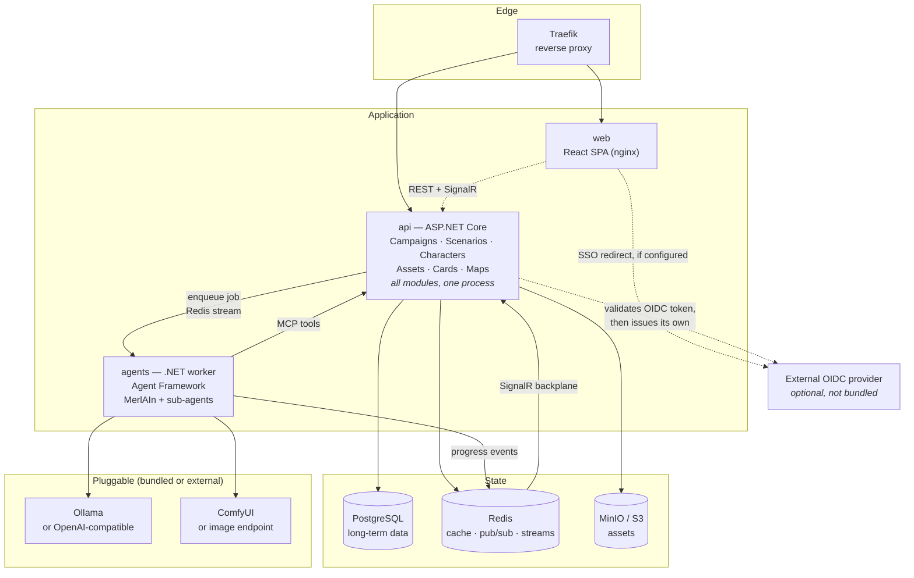
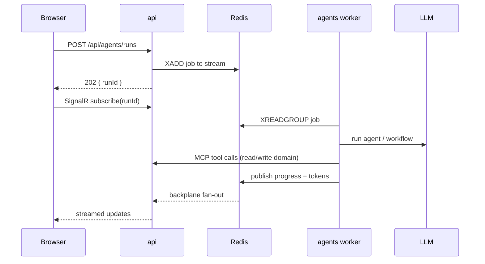
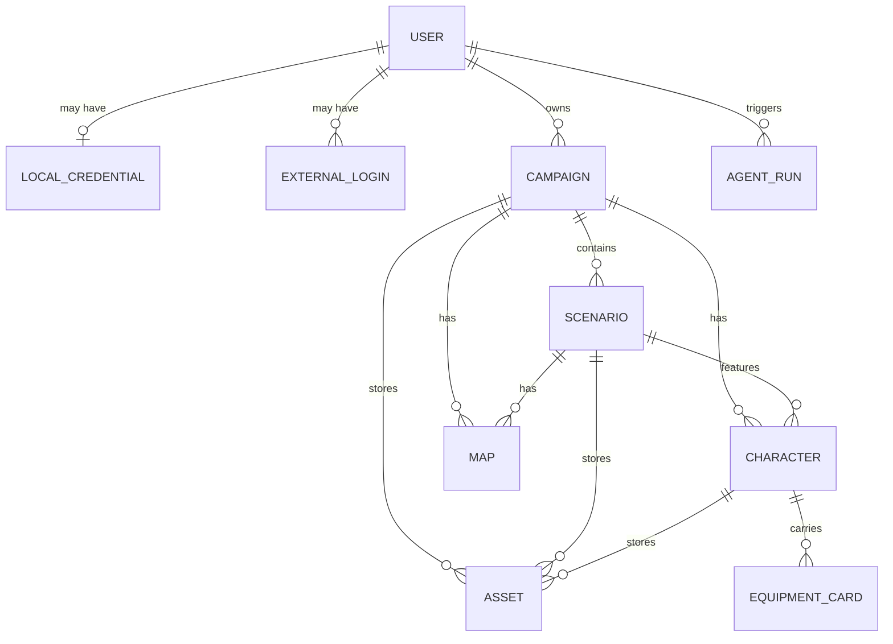
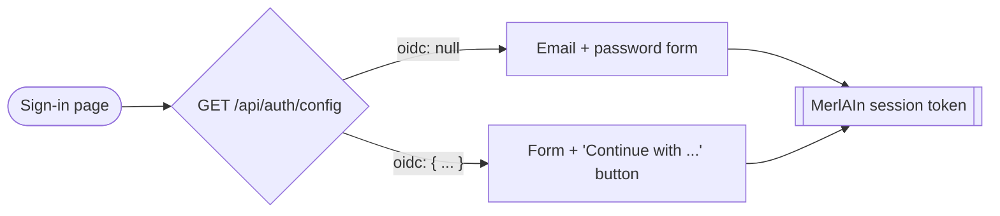

# MerlAIn


> **MerlAIn** is a self-hosted, AI-powered assistant platform for Dungeon Masters.
> It runs entirely on your own hardware via `docker compose`, using only technologies
> that are free to run locally with no licensing constraints.

---

## Table of contents

1. [What is MerlAIn](#1-what-is-merlain)
2. [Features](#2-features)
3. [Architecture](#3-architecture)
4. [The module system](#4-the-module-system)
5. [Deployment model](#5-deployment-model)
6. [Tech stack](#6-tech-stack)
7. [Domain model](#7-domain-model)
8. [Agents](#8-agents)
9. [Configuration](#9-configuration)
10. [Running locally](#10-running-locally)
11. [Roadmap](#11-roadmap)
12. [Contributing: adding a module](#12-contributing-adding-a-module)
13. [Resources](#13-resources)

---

## 1. What is MerlAIn

MerlAIn is a central AI platform where a Dungeon Master can ask their assistant —
**MerlAIn** — for help with the daily grind of running a tabletop campaign: drafting the
next scenario, writing NPC backstories, generating equipment cards, producing maps, and
keeping every asset organised per campaign, scenario and character.

Behind MerlAIn sits a team of specialised background agents (CharaDesigner, Artist,
Scenarist, Cartographer) coordinated through the **Microsoft Agent Framework**, each
reachable through **MCP** tools exposed by the backend.

**Design principles**

| Principle | What it means here |
| --- | --- |
| **Local first** | Everything runs in `docker compose` on a homelab. No cloud dependency required. |
| **No licensing** | Only OSS / free-to-self-host components. |
| **Pluggable** | LLM, image generation and S3 storage are abstractions — bundled by default, or point at your own endpoints. |
| **Modular** | Every feature is a self-contained module bundling UI *and* backend. Adding one touches no shared code. |

---

## 2. Features

### Campaign preparation
- Create and organise **campaigns**, and **scenarios** within them.
- Ask MerlAIn to draft the next scenario of an existing campaign, using the campaign's
  existing lore as context.

### Characters
- Manage four kinds of characters: **Player**, **NPC**, **Monster** and **Quest Token**.
- Generate **backstories**, personality traits and stat blocks for NPCs and monsters.

### Equipment cards
- Generate **equipment cards** combining an image, structured stats and a description.
- Cards are rendered from structured data, so they stay printable and editable.

### Maps
- Display the **background map** of the current scenario.
- Display the campaign's **world map**.

### Asset storage
- Store assets scoped to a **campaign**, a **scenario** or a **character**.
- Assets live in S3-compatible object storage (bundled MinIO, or your own endpoint).

### Assistant experience
- A persistent MerlAIn chat panel available from anywhere in the app.
- Long-running agent work streams progress and tokens live to the UI.

---

## 3. Architecture

MerlAIn is a **modular monolith** backend plus a **modular frontend**, with a separate
worker for long-running AI tasks.



### Request flow for an agent task



---

## 4. The module system

The core idea: **a feature is one folder, front to back.** A *MerlAIn Module* bundles its
React UI, its API client, its backend endpoints and its MCP tools. Adding a feature never
requires editing shell code, routing tables or nav menus.

### Frontend module

Each module exports a **manifest**:

```ts
// apps/web/src/modules/campaigns/index.ts
import { defineModule } from '@merlain/module-sdk';

export default defineModule({
  id: 'campaigns',
  title: 'Campaigns',
  icon: '📜',
  basePath: '/campaigns',          // frontend route prefix
  apiBasePath: '/api/campaigns',   // backend route prefix (same string as the C# module)
  permissions: ['campaigns:read'],
  navOrder: 10,
  routes: [
    { index: true, path: '', element: lazy(() => import('./pages/CampaignsPage')) },
  ],
  widgets: [
    { id: 'campaigns.summary', title: 'Active campaigns', component: /* ... */ },
  ],
});
```

The shell reads a **registry** and derives everything from it:

| Manifest field | Drives |
| --- | --- |
| `title` / `icon` / `navOrder` | The navigation entry |
| `basePath` + `routes` | Lazy-loaded React Router routes |
| `widgets` | Cards rendered on the dashboard |
| `apiBasePath` | The module's own API client base URL |
| `permissions` | Nav + route visibility once auth is wired |

Registering a module is **one line** in [apps/web/src/shell/moduleRegistry.ts](apps/web/src/shell/moduleRegistry.ts).

### Backend module

Each backend module implements `IFeatureModule` and is **auto-discovered by assembly
scanning** at startup:

```csharp
public interface IFeatureModule
{
    string Id { get; }
    string ApiBasePath { get; }

    void RegisterServices(IServiceCollection services, IConfiguration configuration);
    void MapEndpoints(IEndpointRouteBuilder endpoints);
    void RegisterMcpTools(IMcpToolRegistry tools);
}
```

A module owns, inside its own folder:

- minimal API endpoints (`MapEndpoints`)
- MCP tools exposed to the agents (`RegisterMcpTools`)
- its EF Core entities, configuration and migrations
- its services and DI registrations

Because agents talk to the domain through **the same MCP tools** the UI reaches through
REST, there is exactly one implementation of each behaviour.

---

## 5. Deployment model

> **The modular frontend does not imply backend microservices.**

Backend modules are **class libraries compiled into the single `api` process**. "Self-contained"
describes *code boundaries*, not *deployment boundaries*.

**Adding a module = add a project reference, rebuild, redeploy the one `api` container.**
No new service, no routing change, no orchestration work.

### Why a modular monolith

| | Modular monolith *(chosen)* | Full microservices |
| --- | --- | --- |
| App containers | 3 (`web`, `api`, `agents`) | 1 per module |
| Add a module | reference + redeploy `api` | new container, route, DB, pipeline |
| Cross-module call | in-process interface call | network hop + retry / circuit breaker |
| Transactions | single DB, straightforward | sagas / eventual consistency |
| Debugging | one process, one log | distributed tracing required |
| Scaling | replicate `api` behind Traefik | scale per service |
| Fit for a homelab | ✅ | ❌ over-engineered |

Because SignalR uses the **Redis backplane** and all state lives in **Postgres / Redis / S3**,
the `api` container is stateless and can be **replicated behind Traefik** — most of the
scale-out benefit, none of the distributed-systems tax.

### Boundary rules (keep the extraction seam cheap)

These are enforced from day one so any module *can* be extracted later without a rewrite:

1. **Each module owns its Postgres schema.** No cross-module foreign keys, no cross-module joins.
2. **Reference other modules by ID**, through their interface or MCP tool — never reach into
   another module's tables.
3. **No shared mutable in-process state** between modules.
4. **Async cross-module communication goes over Redis streams**, not direct calls.
5. Cross-module synchronous calls go through an interface, so the implementation can silently
   become an HTTP/MCP call later.

Extraction, if ever needed, is then: move the assembly into its own host project, point
Traefik `/api/{module}` at it — **the module contract does not change**.

---

## 6. Tech stack

| Layer | Choice | Why |
| --- | --- | --- |
| Frontend | **React 19 + Vite + TypeScript** | Fast HMR, simple module registry, single build |
| Routing | **React Router** | Lazy routes generated from manifests |
| Backend | **ASP.NET Core (.NET 10)** | Minimal APIs + SignalR + MCP in one host |
| Realtime | **SignalR + Redis backplane** | Streams agent progress, scales across `api` replicas |
| Agents | **Microsoft Agent Framework** | Successor to Semantic Kernel + AutoGen; native Ollama and MCP support |
| Tools | **MCP C# SDK** (`ModelContextProtocol`) | One tool surface for agents and external MCP clients |
| Database | **PostgreSQL 17** | Long-term retention, schema-per-module, JSONB for stat blocks |
| Cache / bus | **Redis 7** | Caching, pub/sub, streams (agent job queue) |
| Object storage | **MinIO** (optional) | S3-compatible; swappable for any external S3 endpoint |
| Identity | **Built-in accounts + optional OIDC** | Email/password out of the box; plug in an existing provider when you have one |
| LLM | **Ollama** (optional) | Local inference; any OpenAI-compatible endpoint also works |
| Image gen | **ComfyUI** (optional) | Local Stable Diffusion; any image endpoint also works |
| Edge | **Traefik** | Automatic routing, single entry point |

All components are free to self-host with no licensing restrictions.

---

## 7. Domain model



| Entity | Notes |
| --- | --- |
| `User` | MerlAIn's own account. `id`, `email`, `displayName`. Owns campaigns, may be a member of others. |
| `LocalCredential` | Optional password for the user: `passwordHash` (Argon2id), `updatedAt`. Absent for SSO-only users. |
| `ExternalLogin` | Optional link to an external identity: `issuer` + `subject` (unique together), `linkedAt`. A user may hold several. |
| `Campaign` | Top-level container. Owner + members. |
| `Scenario` | Belongs to a campaign. The "current session" unit. |
| `Character` | `type`: `Player` \| `NPC` \| `Monster` \| `QuestToken`. Campaign-scoped, optionally scenario-scoped. |
| `EquipmentCard` | `statsJson` (JSONB), `description`, `imageAssetId`. |
| `Map` | `type`: `Background` \| `World`. Scoped to campaign or scenario. |
| `Asset` | `s3Key`, `scope`: `Campaign` \| `Scenario` \| `Character`, plus metadata. |
| `AgentRun` | A conversation / task: `userId`, `status`, streamed messages. |

Each module owns the tables it declares, in its own schema (`identity`, `campaigns`, `characters`, …).

> `User` is the only identity the rest of the application knows about. Whether that user signed in
> with a password or through an external provider is a detail confined to the `identity` schema —
> which is exactly what lets the same campaign survive a move to SSO.

---

## 8. Agents

| Agent | Responsibility |
| --- | --- |
| **MerlAIn** | Orchestrator. Understands DM intent, routes to sub-agents, aggregates results. |
| **Scenarist** | Drafts campaigns and scenarios from existing lore. |
| **CharaDesigner** | NPC / monster backstories, personalities and stat blocks (structured output). |
| **Artist** | Portraits, equipment card art. Requires an image endpoint; disables gracefully without one. |
| **Cartographer** | World and background maps, annotation. |

- Orchestration uses **Agent Framework workflows** for explicit multi-agent control, with
  agents used where the task is open-ended.
- Agents reach the domain **exclusively through MCP tools** exposed by the `api` modules.
- Jobs are queued on a **Redis stream**; the worker consumes them, publishes progress back to
  Redis, and the `api` SignalR hub fans out to the browser.
- The worker is deliberately a **separate container**: long-running AI work never competes with
  interactive API requests, and it can be scaled or restarted independently.

---

## 9. Configuration

All configuration is environment-driven. Copy [.env.example](.env.example) to `.env` and adjust.

| Variable | Default | Purpose |
| --- | --- | --- |
| `POSTGRES_HOST` / `_PORT` / `_DB` / `_USER` / `_PASSWORD` | `postgres` / `5432` / `merlain` / `merlain` / *(set it)* | Database |
| `REDIS_CONNECTION` | `redis:6379` | Cache, pub/sub, streams, SignalR backplane |
| `AUTH_JWT_SIGNING_KEY` | *(set it)* | Signs MerlAIn's own session tokens — `openssl rand -base64 64` |
| `AUTH_JWT_ISSUER` | `https://merlain.local` | Issuer stamped on MerlAIn session tokens |
| `AUTH_LOCAL_ACCOUNTS_ENABLED` | `true` | Offer email + password sign-in |
| `AUTH_ALLOW_REGISTRATION` | `true` | Let visitors create their own account |
| `OIDC_AUTHORITY` | *(empty)* | Empty ⇒ no SSO button. Set it to enable an external provider |
| `OIDC_METADATA_ADDRESS` | *(derived)* | Only when browser and API reach the provider on different URLs |
| `OIDC_CLIENT_ID` / `OIDC_CLIENT_SECRET` | *(empty)* | Secret stays empty for a public PKCE client |
| `OIDC_AUDIENCE` | *(empty)* | Expected `aud`. Many providers put the client id here |
| `OIDC_SCOPES` | `openid profile email` | Scopes requested at authorisation |
| `OIDC_DISPLAY_NAME` | `Single sign-on` | Label of the sign-in button |
| `OIDC_LINK_BY_VERIFIED_EMAIL` | `true` | Attach an SSO login to a matching local account |
| `S3_ENDPOINT` | `http://minio:9000` | Leave as-is for bundled MinIO, or point at your own S3 |
| `S3_ACCESS_KEY` / `S3_SECRET_KEY` | *(set them)* | Object storage credentials |
| `S3_BUCKET` | `merlain-assets` | Asset bucket |
| `LLM_PROVIDER` | `ollama` | `ollama` or `openai-compatible` |
| `LLM_ENDPOINT` | `http://ollama:11434` | Inference endpoint |
| `LLM_MODEL` | `llama3.1` | Default model |
| `LLM_API_KEY` | *(empty)* | Only for OpenAI-compatible endpoints |
| `IMAGE_ENDPOINT` | *(empty)* | Empty ⇒ the Artist agent disables itself |
| `IMAGE_API_KEY` | *(empty)* | Optional |

### Identity

**MerlAIn ships no identity provider.** A homelab usually already has one, and bundling a second
would mean two user directories to keep in sync. Instead the API owns a small `identity` schema and
issues its own session tokens, with two ways of proving who you are — which can run side by side.

#### Mode 1 — local accounts (default)

Email and password, hashed with Argon2id, stored in `identity.local_credentials`. Nothing to
configure beyond `AUTH_JWT_SIGNING_KEY`. This is what you get on a fresh `docker compose up`.

#### Mode 2 — external OIDC (optional)

Set `OIDC_AUTHORITY` to a provider you already run — Authentik, Keycloak, Entra ID, Auth0,
Zitadel, anything speaking OpenID Connect — and the sign-in page grows a
**“Continue with `OIDC_DISPLAY_NAME`”** button. Leave it empty and the button never renders.

The browser uses the authorization code flow with PKCE against the provider. The API validates the
resulting ID token against the provider's JWKS, then mints its **own** session token. Everything
downstream — modules, SignalR, MCP tools — only ever sees a MerlAIn token, so no module needs to
know which mode is in play.



#### Account linking

`identity.external_logins` maps `(issuer, subject)` → `user_id`, so one user can hold a password
**and** one or more external identities. On an SSO sign-in the API resolves the user in this order:

1. An `external_logins` row already matches `(issuer, subject)` → sign in.
2. `OIDC_LINK_BY_VERIFIED_EMAIL=true` and the token carries a **verified** email matching an
   existing user → link the external identity to that user and sign in.
3. Otherwise → create a new user and link.

That is what makes the migration path painless: start on passwords, point `OIDC_AUTHORITY` at your
provider later, and existing accounts absorb their SSO identity on first login. Campaigns, assets
and agent history are attached to the `User`, never to the credential, so nothing moves.

> `OIDC_LINK_BY_VERIFIED_EMAIL` is a **security control**, not a convenience flag. Step 2 trusts the
> provider's `email_verified` claim; a provider that lets users self-assert an address would allow
> account takeover. Set it to `false` if you cannot vouch for that claim.

#### Frontend discovery

The sign-in page reads `GET /api/auth/config` at runtime rather than a build-time variable, so one
`web` image works against a deployment with SSO and one without:

```jsonc
{
  "localAccounts": { "enabled": true, "allowRegistration": true, "minimumPasswordLength": 12 },
  "oidc": null   // or { "enabled": true, "displayName": "Authentik", "authority": "...", "clientId": "...", "scopes": "..." }
}
```

The response deliberately carries no secret: `OIDC_CLIENT_SECRET` and `AUTH_JWT_SIGNING_KEY` never
leave the API.

### Pluggability

`S3_ENDPOINT`, `LLM_ENDPOINT` and `IMAGE_ENDPOINT` are the seams. Point them at an existing
service and the corresponding optional container simply never starts:

```bash
docker compose up -d                                    # core only
docker compose --profile storage --profile llm up -d    # + MinIO + Ollama
docker compose --profile imagegen up -d                 # + ComfyUI
```

---

## 10. Running locally

### Repository layout

```
MerlAIn/
├── MerlAIn.slnx                 # .NET solution
├── Directory.Build.props        # shared TFM / nullable / docs settings
├── docker-compose.yml
├── .devcontainer/               # dev container: .NET 10 + Node 22, joins the stack network
├── apps/
│   ├── web/                     # React shell + modules (npm workspace)
│   │   └── src/modules/         # one folder per feature — see its README
│   ├── api/                     # ASP.NET Core host: modules, SignalR, MCP
│   │   └── Modules/             # backend half of each feature
│   └── agents/                  # background worker running agent workflows
├── libs/
│   ├── web/module-sdk/          # defineModule, registry, module API client
│   └── dotnet/MerlAIn.Shared/   # IFeatureModule, IObjectStorage, AI abstractions
└── infra/
    ├── postgres/init.sql        # one schema per module, including `identity`
    └── traefik/traefik.yml
```

### Prerequisites

| Tool | Version | Needed for |
| --- | --- | --- |
| Node.js | ≥ 20 | Frontend dev server |
| .NET SDK | 10.0 | Building the backend outside Docker *(optional — Docker builds it for you)* |
| Docker + Compose | recent | Full stack |

### Frontend only — the quickest way to see the app

```bash
npm install
npm run dev
```

Then open <http://localhost:5173>. The shell boots, discovers the registered modules and
builds the navigation, dashboard widgets and routes from their manifests.

> The scaffold's modules render placeholder content — no backend is required.

### Full stack

```bash
cp .env.example .env      # then set the passwords and AUTH_JWT_SIGNING_KEY
docker compose up -d --build
```

| Service | URL |
| --- | --- |
| App | <http://localhost> |
| API | <http://localhost/api> |
| Sign-in capabilities | <http://localhost/api/auth/config> |
| MinIO console *(profile `storage`)* | <http://localhost:9001> |

> No identity provider is started. The stack comes up with local email and password accounts;
> set `OIDC_AUTHORITY` in `.env` to add an SSO button pointing at a provider you already run.

### Dev container

`.devcontainer/` gives you the .NET 10 SDK and Node 22 without installing either on the host.
It uses **Docker outside of Docker** — the host socket is bound in, so containers you start are
siblings rather than nested, and `docker compose up` behaves exactly as it would from a host
terminal.

On every start it attaches itself to the stack's `merlain` bridge network, so services resolve by
name from inside: `postgres:5432`, `redis:6379`, `api:8080`. `VITE_DEV_API_TARGET` is preset so
`npm run dev` proxies to the containerised API instead of `localhost`.

> Because the dev container holds an endpoint on that network, `docker compose down` will report
> it cannot remove `merlain` while the dev container is attached. The containers still stop; the
> network is reused next time.

### Useful commands

```bash
npm run dev            # frontend dev server
npm run build          # typecheck + production build
dotnet build MerlAIn.slnx
docker compose config  # validate compose + profiles
docker compose logs -f api agents
```

> `dotnet build` needs the .NET 10 SDK. Without it, build through Docker instead —
> `docker compose build api agents` — which is the supported path anyway.

---

## 11. Roadmap

| Phase | Scope | Status |
| --- | --- | --- |
| **0** | Monorepo scaffolding, module contracts, runnable shell, API host with module discovery | ✅ done |
| **1** | Infra: Postgres, Redis, optional MinIO / Ollama / ComfyUI | 🔜 |
| **2** | Backend foundation: EF Core, migrations, identity (local accounts + optional OIDC), SignalR + Redis backplane | 🔜 |
| **3** | Module system hardening: DI scanning, per-module schemas, permissions | 🔜 |
| **4** | Domain modules: Campaigns, Scenarios, Characters, Assets | 🔜 |
| **5** | Agent layer: worker, Agent Framework, MCP servers, streaming | 🔜 |
| **6** | Media modules: Equipment cards, Maps, Artist + Cartographer | 🔜 |
| **7** | Frontend polish: dashboard, MerlAIn chat panel, asset browser, map viewer | 🔜 |

**Phase 0 delivers structure and contracts only** — no business logic, no persistence,
no auth wiring, no agent implementations.

---

## 12. Contributing: adding a module

Adding a feature called `bestiary` is four steps and touches **no shared code**:

**1. Frontend module** — create `apps/web/src/modules/bestiary/` with:

```
bestiary/
  index.ts                  # the manifest (defineModule)
  api/client.ts             # its own API client, based on apiBasePath
  pages/BestiaryPage.tsx    # its routes' components
  widgets/…                 # optional dashboard widgets
```

**2. Register it** — one line in [apps/web/src/shell/moduleRegistry.ts](apps/web/src/shell/moduleRegistry.ts):

```ts
import bestiary from '../modules/bestiary';

export const registry = createModuleRegistry([campaigns, bestiary]);
```

**3. Backend module** — create `apps/api/Modules/Bestiary/BestiaryModule.cs` implementing
`IFeatureModule`. Assembly scanning picks it up automatically; no registration needed.

**4. Respect the boundary rules** from [§5](#5-deployment-model) — own your schema, reference
other modules by ID through their interface or MCP tool.

That's it: the nav entry, the routes, the dashboard widgets and the API surface all appear.

---

## 13. Resources

- [33000 Free Sounds from BBC](https://sound-effects.bbcrewind.co.uk/)
- [Microsoft Agent Framework](https://learn.microsoft.com/agent-framework/)
- [MCP C# SDK](https://github.com/modelcontextprotocol/csharp-sdk)
